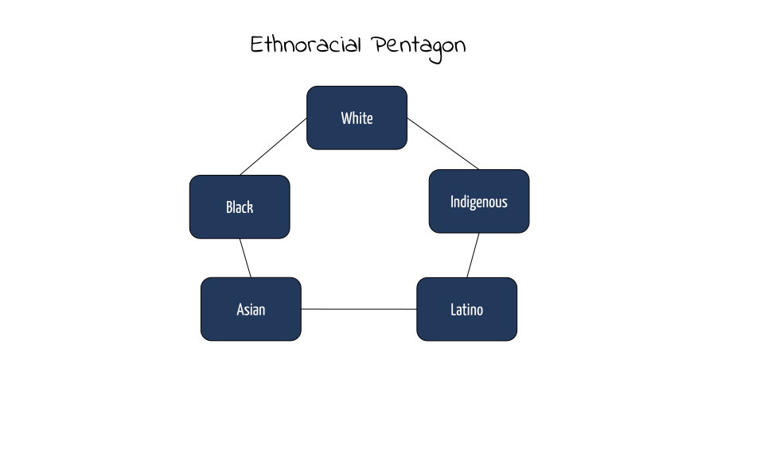
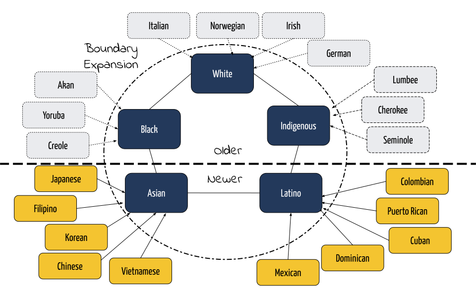
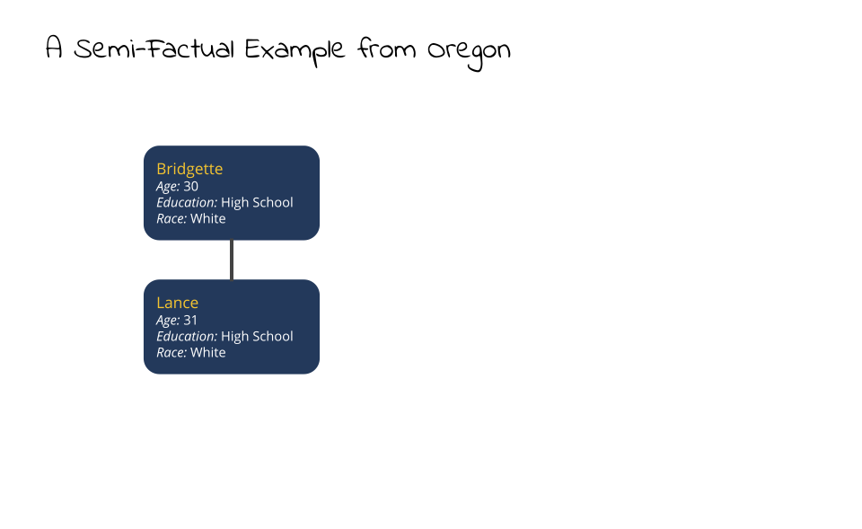

```{r setup, include=FALSE}
knitr::opts_chunk$set(fig.retina = 3, message=FALSE, warning=FALSE, echo=FALSE,
                      fig.width=13, fig.height=6.5, fig.align="center")
library(here)
source(here("analysis","check_packages.R"))
source(here("analysis","useful_functions.R"))
library(glue)
library(xkcd)
library(ggtext)
load(here("analysis","output","models_restricted.RData"))
```

```{r xaringan-themer, include=FALSE, warning=FALSE}
library(xaringanthemer)
style_mono_light(base_color="#23395b",
                 white_color="#EAEBEE",
  header_font_google = google_font("Yanone Kaffeesatz", "400"),
  text_font_google   = google_font("Open Sans", "400", "400i"),
  code_font_google   = google_font("Fira Mono")
)
library(showtext)
## Loading Google fonts (https://fonts.google.com/)
font_add_google("Gochi Hand", "gochi")
font_add_google("Schoolbell", "bell")
font_add_google("Indie Flower", "indie-flower")

## Automatically use showtext to render text
showtext_auto()
```

```{r custom-ggtheme, include=FALSE}
theme_myslides <- theme_xaringan(background_color = "#EAEBEE")+
  theme(plot.title = element_text(size=24, hjust=0),
        plot.title.position = "panel",
        plot.subtitle = element_text(size=16, hjust=0),
        plot.caption = element_text(size=14, hjust=1, vjust=1),
        plot.caption.position = "panel",
        text = element_text(colour="#000000"),
        axis.title = element_text(size=20),
        axis.line = element_line(colour="#000000", size = 1),
        axis.ticks = element_line(colour="#000000", size = 1),
        axis.text = element_text(size=16),
        legend.title = element_text(size=20),
        legend.text = element_text(size=16),
        panel.grid.major = element_blank(),
        panel.grid.minor = element_blank(), 
        panel.border = element_rect(fill=NA, colour=NA),
        panel.background = element_rect(fill = "#EAEBEE",colour = NA),
        plot.background = element_rect(fill = "#EAEBEE",colour = NA),
        legend.background = element_rect(fill = "#EAEBEE",colour = NA),
        legend.key = element_rect(fill = "#EAEBEE",colour = NA), 
        legend.position = "bottom")
theme_set(theme_myslides)
```

```{r coef-table}
#extract coefficicent values
get_coefs <- function(x) {
  return(coef(x)[,c(1,3)])
}
temp <- lapply(models_census_summary, get_coefs)
coef_table <- NULL
for(i in 1:length(temp)) {
  coef_table <- rbind(coef_table, 
                      tibble(variable=rownames(temp[[i]]),
                             coef=temp[[i]][,"coef"],
                             se=temp[[i]][,"se(coef)"],
                             model=paste("Model",i),
                             data="Census 1980"))
}
temp <- lapply(models_acs_summary, get_coefs)
for(i in 1:length(temp)) {
  coef_table <- rbind(coef_table, 
                      tibble(variable=rownames(temp[[i]]),
                             coef=temp[[i]][,"coef"],
                             se=temp[[i]][,"se(coef)"],
                             model=paste("Model",i),
                             data="ACS 2014-18"))
}
coef_table$racial_exog <- grepl("race_exog", coef_table$variable)
#fix up the names
temp_names <- unique(coef_table$variable)
better_names <- c("age difference", "age difference squared",
                  "female educational hypergamy", "female educational hypogamy",
                  "educational crossing LHS/HS", "educational crossing HS/SC",
                  "educational crossing SC/C", "Black/White","Indigenous/White",
                  "Asian/White","Hispanic/White","Asian Indian/White",
                  "Black/Indigenous","Black/Asian","Black/Hispanic",
                  "Black/Asian Indian","Indigenous/Asian","Indigenous/Hispanic",
                  "Indigenous/Asian Indian","Asian/Hispanic",
                  "Asian/Asian Indian","Hispanic/Asian Indian",
                  "Asian ethnic exogamy","Hispanic ethnic exogamy", 
                  "birthplace endogamy","language endogamy")
names(better_names) <- temp_names
coef_table$variable <- better_names[coef_table$variable]
coef_table$model <- factor(coef_table$model,
                           levels=paste("Model",1:4),
                           labels=c("Baseline", "+ birthplace endogamy",
                                    "+ language endogamy", "+ both"))
coef_table$data <- factor(coef_table$data,
                          levels=c("Census 1980", "ACS 2014-18"))
```

## Shifting Boundaries in Interracial Marriage

```{r bigsplash}
#create the splash image figure here
temp <- coef_table %>%
  filter(model=="+ both") %>%
  dcast(variable+racial_exog~data, value.var="coef") %>%
  rename(coef.census=`Census 1980`, coef.acs=`ACS 2014-18`)

#reorder based on ACS values
temp$variable <- reorder(temp$variable, temp$coef.acs, max)
coef_table$variable <- factor(coef_table$variable,
                              levels=levels(temp$variable))
#put in missing values for two cases in temp to get rid of really small
#arrows
temp$coef.census <- ifelse(abs(temp$coef.census-temp$coef.acs)<0,
                           temp$coef.census-0.01,
                           temp$coef.census+0.01)

temp$coef.census <- ifelse(abs(temp$coef.census-temp$coef.acs)<.1, NA,
                           temp$coef.census)


ggplot(subset(coef_table, racial_exog & model=="+ both"), 
       aes(x=variable, y=exp(coef)))+
  geom_hline(yintercept = 1, linetype=2, color="#EAEBEE", size=2)+
  geom_point(aes(color=data), size=6)+
  geom_segment(data=subset(temp, racial_exog), size=2, alpha=0.7, linetype=1,
               aes(x=variable, xend=variable, 
                   y=exp(coef.census), yend=exp(coef.acs)),
               arrow = arrow(length = unit(0.02, "npc")),
               color="#808080")+
  annotate("rect", xmin = 13.5, xmax = 14.5, ymin = 0, ymax = 1.5,
           alpha = 0.4, color=NA, fill="#18273F")+
  annotate("rect", xmin = 16.5, xmax = 17.5, ymin = 0, ymax = 1.5,
           alpha = 0.4, color=NA, fill="#18273F")+
  coord_flip()+
  scale_y_log10()+
  scale_color_manual(values=c("red","#FFFF00"))+
  labs(x=NULL, 
       y="odds ratio of union formation relative to racially endogamous union, logarithmic scale",
       color="data source")
```

???

- Sneak Preview: Showing you the punchline figure at the beginning. 
- Obviously a lot going on here that I will get into in the talk
  - Changes across two points in time in "racial" boundaries
  - if you look carefully not all of these boundaries would be classified as race or at least "big" race
- Lot of interesting stuff here that I will highlight later

---

## Two Projects

???

- Combination of two different projects
- The first project is the development of a new(ish) approach to modeling assortative mating
  - An intuitive alternative to the traditional log-linear approach
  - Happy to say that I now have an article forthcoming in *Demographic Research* that outlines the new technique
- The second project looks at changes in interracial marriage in the United States
  - Made possible by recent changes in Census questions that allow us to measure timing of marriage
  - looking at two points in time (1980 and 2013-2018)
  - Specific focus on questions of pan-ethnicity

--

.pull-left[
### A New Approach to Modeling The Process of Partner Selection
.center[

]
]

--

.pull-right[
### Empirical Analysis of Changes in Interracial Marriage from 1980-2018
.center[


]
]

---

## Why Should We Care About Interracial Marriage?

???

- Measure of social boundaries
  - long considered the best indicator of the strength of social boundaries that define and separate groups
  - committed intergroup interaction in the most intimate realm of life
  - extensive work on the assimilation of Euroethnics, for example, has used intermarriage as a key signifier, but also as a causal mechanism...
- Challenge
  - Measure of existing strength but also presents an incipient challenge to existing boundaries. 
  - mixed-race children in the next generation. How will they be identified and classified? Be clear its a challenge but not an insurmountable one to existing systems (i.e. one-drop rule).
  - integrates extended family/kin networks. 

--

.pull-left[
### Measure of Social Boundaries

]

--

.pull-right[
### Challenge to Existing Boundaries

]

---

.center[

]

---

.center[

]

---

.center[

]

---

.center[

]

---

.center[

]

---

.center[

]

---

## How Do We Measure Prevalence of Intermarriage?

--

.pull-left[
### Log-Linear Models

We first create a cross-tabulation of husbands' and wives' characteristics:

|           |W Group 1|W Group 2|W Group 3|
|-----------|---------|---------|---------|
|H Group 1  | $F_{11}$| $F_{12}$| $F_{13}$|
|H Group 2  | $F_{21}$| $F_{22}$| $F_{23}$|
|H Group 3  | $F_{31}$| $F_{32}$| $F_{33}$|

We then predict the counts within each cell by maginal and joint parameters:

$$\log(F_{ij})=\lambda+\lambda_i+\lambda_j+\lambda_{ij}$$
]

--

.pull-right[
### Benefits and Drawbacks

`r emo::ji("+1")` Marginal distributions account for group size<br>
`r emo::ji("-1")` The *unmarried exclusion bias*<br>
`r emo::ji("-1")` Assumes a single marriage market<br>
`r emo::ji("-1")` Non-intuitive and complex<br>
`r emo::ji("-1")` Handles quantitative variables (e.g. age) poorly<br>
]

---

## A Counterfactual Approach

--

1. For each actual union, randomly choose one spouse.

--

2. For the chosen spouse, sample $j$ alternate partners that are drawn from the population of **single and recently married** individuals from the **same geographic** region.

--

3. Use a conditional logit model to look at how partner characteristics affect the likelihood of the actual union within the choice set. Examples could be:
  - age differences
  - educational homogamy, hypergamy, and hypogamy
  - racial exogamy
  - language endogamy

--

#### Benefits and Drawbacks of this Approach

`r emo::ji("+1")` Implicitly addresses "supply" issue in partner characteristics through sampling<br>
`r emo::ji("+1")` Allows for a tight specification of the marriage market<br>
`r emo::ji("+1")` Includes the single population in the pool of potential partners<br>
`r emo::ji("+1")` Easy to model using standard linear model framework<br>
`r emo::ji("-1")` Computationally intensive to sample partners<br>
`r emo::ji("-1")` Requires detailed marriage formation data

---

.center[

]

---

.center[

]

---

.center[

]


---

## How Do Partner Age Differences Affect Likelihood of Marriage?

```{r age-graph}
agediff <- seq(from=-20, to=20, by=0.1)
age_linear <- coef_table$coef[coef_table$variable=="age difference" &
                                coef_table$model=="+ both" &
                                coef_table$data=="ACS 2014-18"]
age_squared <- coef_table$coef[coef_table$variable=="age difference squared" &
                                coef_table$model=="+ both" &
                                coef_table$data=="ACS 2014-18"]

odds <- exp(age_linear*agediff+
              age_squared*(agediff^2))
max_age_diff <- age_linear/(-2*age_squared)

ggplot(data.frame(agediff, odds), aes(x=agediff, y=odds))+
  geom_line(size=2)+
  scale_y_continuous(breaks = c(0,0.25,0.5,0.75,1,1.25))+
  geom_vline(xintercept = max_age_diff, linetype=1, color="red",
             size=3)+
  geom_hline(yintercept = 1, size=1, linetype=3)+
  geom_vline(xintercept = 0, size=1, linetype=3)+
  annotate("text", x=11, y=0.5, 
           label="Likelihood is maximized when\nhusband is 2.16 years older than wife",
           size=7, family="indie-flower", angle=9, color="grey35")+
  labs(x="Husband's age minus wife's age", 
       y="Odds of union relative to partners of the same age")
```

---

## Data Sources

.pull-left[
#### Census 1980

#### American Community Survey 2014-18

]

--

.pull-right[
### Constructing Analytical Data
- Marriages restricted to:
    - Those formed within the last five years.
    - Both spouses were present in the same state for the last five years.
- Pool of eligible partners restricted to:
    - Currently single individuals and those married in the last five years.
    - Present in the same state for the last five years.
- I sample 25 alternative partners for one randomly selected marriage partner to create choice sets.
]
---

## Block diagram of interracial marriage

---

## What does the model control for?

- Age differences
- Education differences
- Birthplace endogamy
- Language endogamy
- Native/immigrant preferences

---

## Figure showing the effects of language/birthplace controls

---

## Full figure

???

- show where pan-ethnic parameters line up
- black intermarriage still the most likely although gains over time
- only decreases are for Indigenous and Asian Indian populations

```{r}
ggplot(subset(coef_table, racial_exog & model=="+ both"), 
       aes(x=variable, y=exp(coef)))+
  geom_hline(yintercept = 1, linetype=2, color="#EAEBEE", size=2)+
  geom_point(aes(color=data), size=6)+
  geom_segment(data=subset(temp, racial_exog), size=2, alpha=0.7, linetype=1,
               aes(x=variable, xend=variable, 
                   y=exp(coef.census), yend=exp(coef.acs)),
               arrow = arrow(length = unit(0.02, "npc")),
               color="#808080")+
  coord_flip()+
  scale_y_log10()+
  scale_color_manual(values=c("red","#FFFF00"))+
  labs(x=NULL, 
       y="odds ratio of union formation relative to racially endogamous union, logarithmic scale",
       color="data source")
```

--- 

## Conclusions