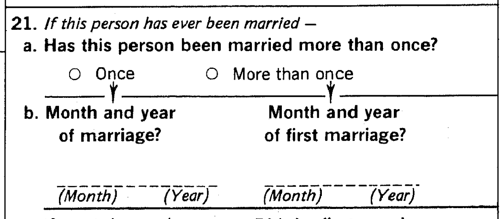
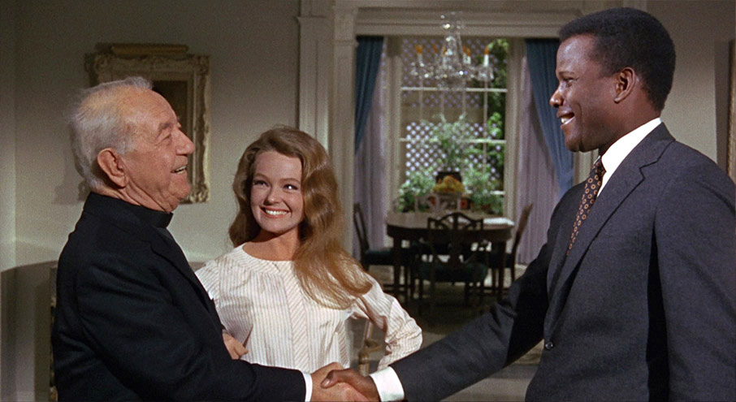
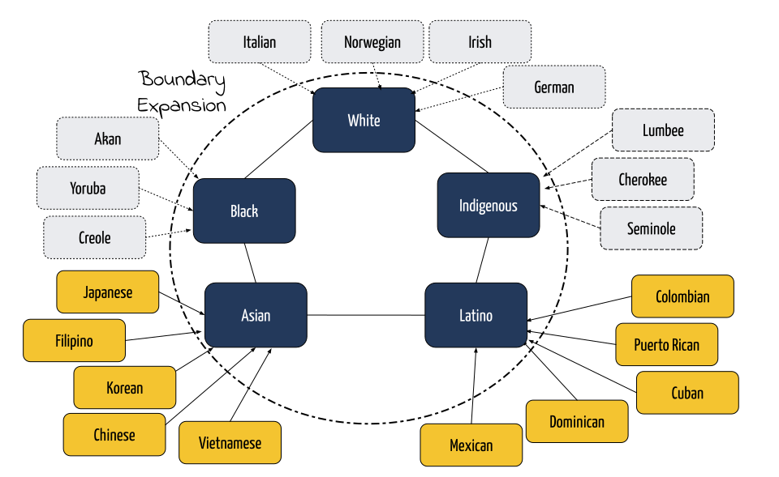
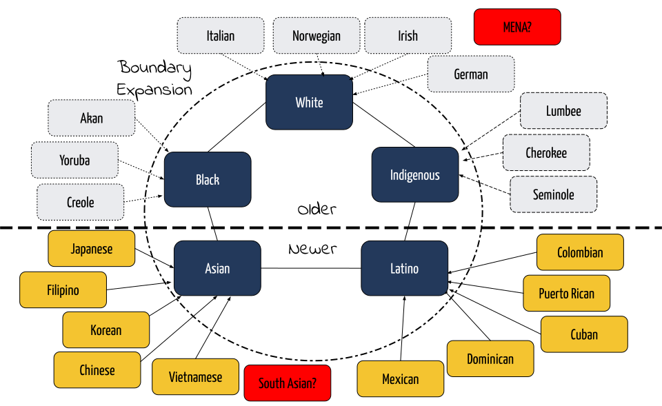
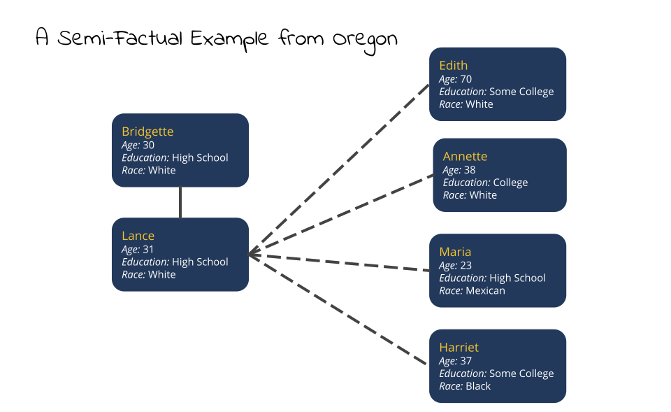
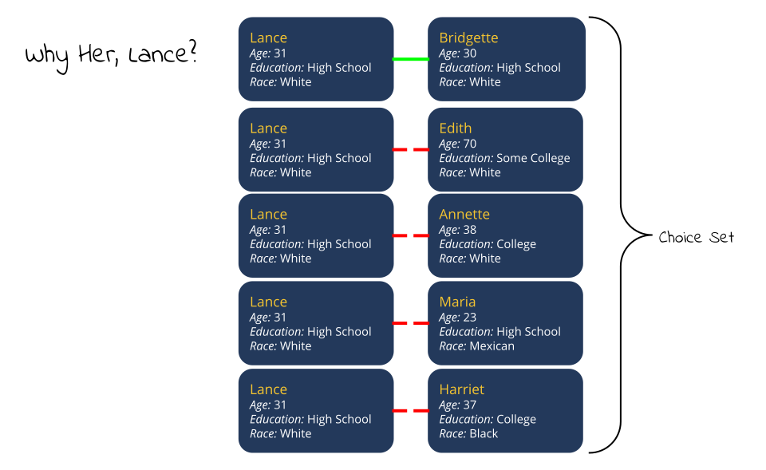

```{r setup, include=FALSE}
knitr::opts_chunk$set(fig.retina = 3, message=FALSE, warning=FALSE, echo=FALSE,
                      fig.width=13, fig.height=6.5, fig.align="center")
library(here)
source(here("analysis","check_packages.R"))
source(here("analysis","useful_functions.R"))
library(glue)
library(xkcd)
library(ggtext)
library(ggforce)
library(ggalt)
library(ggstance)
library(kableExtra)
load(here("analysis","output","models_restricted.RData"))
```

```{r xaringanExtra, echo=FALSE}
xaringanExtra::use_xaringan_extra(c("tile_view"))
```

```{r xaringan-themer, include=FALSE, warning=FALSE}
library(xaringanthemer)
style_mono_light(base_color="#23395b",
                 white_color="#EAEBEE",
  header_font_google = google_font("Yanone Kaffeesatz", "400"),
  text_font_google   = google_font("Open Sans", "400", "400i"),
  code_font_google   = google_font("Fira Mono")
)
library(showtext)
## Loading Google fonts (https://fonts.google.com/)
font_add_google("Gochi Hand", "gochi")
font_add_google("Schoolbell", "bell")
font_add_google("Indie Flower", "indie-flower")

## Automatically use showtext to render text
showtext_auto()
```

```{r custom-ggtheme, include=FALSE}
theme_myslides <- theme_xaringan(background_color = "#EAEBEE")+
  theme(plot.title = element_text(size=24, hjust=0),
        plot.title.position = "panel",
        plot.subtitle = element_text(size=16, hjust=0),
        plot.caption = element_text(size=14, hjust=1, vjust=1),
        plot.caption.position = "panel",
        text = element_text(colour="#000000"),
        axis.title = element_text(size=20),
        axis.line = element_line(colour="#000000", size = 1),
        axis.ticks = element_line(colour="#000000", size = 1),
        axis.text = element_text(size=16),
        legend.title = element_text(size=20),
        legend.text = element_text(size=16),
        panel.grid.major = element_blank(),
        panel.grid.minor = element_blank(), 
        panel.border = element_rect(fill=NA, colour=NA),
        panel.background = element_rect(fill = "#EAEBEE",colour = NA),
        plot.background = element_rect(fill = "#EAEBEE",colour = NA),
        legend.background = element_rect(fill = "#EAEBEE",colour = NA),
        legend.key = element_rect(fill = "#EAEBEE",colour = NA), 
        legend.position = "bottom")
theme_set(theme_myslides)
```

```{r coef-table}
#extract coefficicent values
get_coefs <- function(x) {
  return(coef(x)[,c(1,3)])
}
temp <- lapply(models_census_summary, get_coefs)
coef_table <- NULL
for(i in 1:length(temp)) {
  coef_table <- rbind(coef_table, 
                      tibble(variable=rownames(temp[[i]]),
                             coef=temp[[i]][,"coef"],
                             se=temp[[i]][,"se(coef)"],
                             model=paste("Model",i),
                             data="Census 1980"))
}
temp <- lapply(models_acs_summary, get_coefs)
for(i in 1:length(temp)) {
  coef_table <- rbind(coef_table, 
                      tibble(variable=rownames(temp[[i]]),
                             coef=temp[[i]][,"coef"],
                             se=temp[[i]][,"se(coef)"],
                             model=paste("Model",i),
                             data="ACS 2014-18"))
}
coef_table$racial_exog <- grepl("race_exog", coef_table$variable)
#fix up the names
temp_names <- unique(coef_table$variable)
better_names <- c("age difference", "age difference squared",
                  "female educational hypergamy", "female educational hypogamy",
                  "educational crossing LHS/HS", "educational crossing HS/SC",
                  "educational crossing SC/C", "Black/White","Indigenous/White",
                  "Asian/White","Latino/White","Asian Indian/White",
                  "Black/Indigenous","Black/Asian","Black/Latino",
                  "Black/Asian Indian","Indigenous/Asian","Indigenous/Latino",
                  "Indigenous/Asian Indian","Asian/Latino",
                  "Asian/Asian Indian","Latino/Asian Indian",
                  "Asian ethnic exogamy","Latino ethnic exogamy", 
                  "birthplace endogamy","language endogamy")
names(better_names) <- temp_names
coef_table$variable <- better_names[coef_table$variable]
coef_table$model <- factor(coef_table$model,
                           levels=paste("Model",1:4),
                           labels=c("Baseline", "+ birthplace endogamy",
                                    "+ language endogamy", "+ both"))
coef_table$data <- factor(coef_table$data,
                          levels=c("Census 1980", "ACS 2014-18"))

#create the splash image figure here
df_arrows <- coef_table %>%
  filter(model=="+ both") %>%
  dcast(variable+racial_exog~data, value.var="coef") %>%
  rename(coef.census=`Census 1980`, coef.acs=`ACS 2014-18`)

#reorder based on ACS values
df_arrows$variable <- reorder(df_arrows$variable, df_arrows$coef.acs, max)
coef_table$variable <- factor(coef_table$variable,
                              levels=levels(df_arrows$variable))
#put in missing values for two cases in df_arrows to get rid of really small
#arrows
df_arrows$coef.census <- ifelse(abs(df_arrows$coef.census-df_arrows$coef.acs)<0,
                           df_arrows$coef.census-0.01,
                           df_arrows$coef.census+0.01)
df_arrows$coef.census <- ifelse(abs(df_arrows$coef.census-df_arrows$coef.acs)<.1, 
                                NA, df_arrows$coef.census)
```

## Two Projects

???

- Combination of two different projects
- The first project is the development of a new(ish) approach to modeling assortative mating
  - An intuitive alternative to the traditional log-linear approach
  - Happy to say that I now have an article condtionally accepted in *Demographic Research* that outlines the new technique
- The second project looks at changes in interracial marriage in the United States
  - Made possible by recent changes in Census questions that allow us to measure timing of marriage
  - looking at two points in time (1980 and 2014-2018)
  - Specific focus on the issue of pan-ethnicity among Asian and Latino national-origin/ethnic groups

--

.pull-left[
### A New Approach to Modeling The Process of Partner Selection
.center[

]
]

--

.pull-right[
### Empirical Analysis of Changes in Interracial Marriage from 1980-2018
.center[


]
]

---

## Why Should We Care About Interracial Marriage?

???

- Measure of social boundaries
  - long considered the best indicator of the strength of social boundaries that define and separate groups
  - committed intergroup interaction in the most intimate realm of life
  - extensive work on the assimilation of Euroethnics, for example, has used intermarriage as a key signifier, but also as a causal mechanism...
- Challenge
  - Measure of existing strength but also presents an incipient challenge to existing boundaries. 
  - mixed-race children in the next generation. How will they be identified and classified? Be clear its a challenge but not an insurmountable one to existing systems (i.e. one-drop rule).
  - integrates extended family/kin networks. 

--

.pull-left[
### Measure of Social Boundaries

]

--

.pull-right[
### Challenge to Existing Boundaries

]

---

.center[

]

???

* Ethnoracial pentagon
  * coined by historian David Hollinger
  * describes the increasingly taken for granted categorization of the US into five racial categories, supported by state practices and social norms
  * The categories are quite similar to original color-coded taxonomic categories of Blumenbach: White, Black, Red, Yellow, and Brown (with caveats on brown)
  * I have used the term "big race" to describe these categories as a parallel to Grusky and Weeden's "big class" concept

---

.center[

]

???

* Pan-ethnicity is often used in reference to the clear national-origin ("ethnic") distinctions among groups that make up the Asian and Latino categories.
* Pan-ethnicity is the tendency towards identifying with the larger umbrella category of Asian or Latino in contrast to other lower-level distinctions.
* Pan-ethnicity should be a surprising outcome - nationality produces strong identities.
* Asian and Latino pan-ethnicity is thought to have increased with the growth of these populations in the US, because of:
  * state actions to categorize and count
  * ethnic entrepreneurs
  * identity-based organizations (e.g. National Council of La Raza)
* Intermarriage is often thought of as an excellent measure of the degree of pan-ethnicity among groups. 

---

.center[

]

???

* While pan-ethnicity among Asians and Latinos is the most historically salient, we can think of similar consolidation occurring for each of the other categories in the racial pentagon.
  * most well-studied is the creation (or expansion) of whiteness from a variety of European ethnic groups who often had great antipathy toward one another. 
  * similar process occurred even earlier for blacks in the US, where the institution of slavery was a powerful vehicle for assimilation. 
  * process has been more partial and complex for indigenous populations. Some strong tribal connections mixed with a large population without any strong tribal identity.

---

.center[

]

???

* In the lingo of boundary formation theory, we can think of pan-ethnicity more generally as a case of boundary expansion: Pushing back the level of important boundaries to a higher level.
  * Each form of boundary expansion however has unique features that have contributed to the present dynamics of race in the US.
  * white boundary expansion was part of a process of nation-building.
  * black and indigenous boundary expansion was part of a process of ethnogenesis, but with opposing rules in how to handle mixed offspring.

---

.center[

]

???

* The distinction between older projects of boundary expansion and contemporary pan-ethnicity is about timing. The original "triangle" of American race relations has been extended to two more recent entries.
* Asian and Latino boundary expansion is an ongoing project and the boundaries between national-origin groups are "brighter". 
* There are some important differences between the Asian and Latino case to be aware of:
    * Latinos connected by single language, but Asians are not.
    * Latino classification has resisted racialization more than Asian case.
    * "model minority" status of Asian Americans as well as class advantages.

---

.center[

]

???

* It is worth noting that certain identifications still don't fit well within this racial pentagon. 
  * MENA category (itself a pan-ethnic designation). They are supposed to check white.
  * South Asians - Generally classified as Asian, but "Asian" in the US is often used to references someone of east of southeast Asian origin, and thus South Asians don't quite fit. 

---

## How Do We Measure Prevalence of Intermarriage?

--

.pull-left[
### Log-Linear Models

We first create a cross-tabulation of husbands' and wives' characteristics:

|           |W Group 1|W Group 2|W Group 3|
|-----------|--------:|--------:|--------:|
|H Group 1  | $F_{11}$| $F_{12}$| $F_{13}$|
|H Group 2  | $F_{21}$| $F_{22}$| $F_{23}$|
|H Group 3  | $F_{31}$| $F_{32}$| $F_{33}$|

We then predict the counts within each cell by marginal and joint parameters:

$$\log(F_{ij})=\lambda+\lambda_i+\lambda_j+\lambda_{ij}$$
]

???

* Note that the log-linear model can incorporate more dimensions here. 

--

.pull-right[
### Benefits and Drawbacks

`r emo::ji("+1")` Marginal distributions account for group size<br>
`r emo::ji("-1")` The *unmarried exclusion bias*<br>
`r emo::ji("-1")` Assumes a single marriage market<br>
`r emo::ji("-1")` Non-intuitive and complex<br>
`r emo::ji("-1")` Handles quantitative variables (e.g. age) poorly<br>
]


---

## A Counterfactual Approach

--

1. For each actual union, randomly choose one spouse.

--

2. For the chosen spouse, sample $j$ alternate partners that are drawn from the population of **single and recently married** individuals from the **same geographic** region.

--

3. Use a conditional logit model to look at how partner characteristics affect the likelihood of the actual union within the choice set. Examples could be:
  - age differences
  - educational homogamy, hypergamy, and hypogamy
  - racial exogamy
  - language endogamy

--

#### Benefits and Drawbacks of this Approach

`r emo::ji("+1")` Implicitly addresses group size differences through sampling<br>
`r emo::ji("+1")` Allows for a better specification of the marriage market<br>
`r emo::ji("+1")` Includes the single population in the pool of potential partners<br>
`r emo::ji("+1")` Easy to model using the standard linear model framework<br>
`r emo::ji("-1")` Computationally intensive to sample partners<br>
`r emo::ji("-1")` Requires detailed marriage formation data

---

.center[

]

???

* Actual couple, but not real names. If ethnographers get to make up cool names for their subjects why can't quanties?


---

.center[

]

???

* We pull four alternate wives for Lance from single or recently married women.
* We chose husband randomly. In other cases we choose the wife and alternate husbands.
* heterosexuality bias: possible to build this model for LGBT couples as well but some additional complexities. Happy to talk about it in Q&A.

---

.center[

]

???

* We can more formally use a logit model to identify the joint characteristics that lead to a real match.

---

## How Do Partner Age Differences Affect Likelihood of Marriage?

```{r age-graph}
agediff <- seq(from=-20, to=20, by=0.1)
age_linear <- coef_table$coef[coef_table$variable=="age difference" &
                                coef_table$model=="+ both" &
                                coef_table$data=="ACS 2014-18"]
age_squared <- coef_table$coef[coef_table$variable=="age difference squared" &
                                coef_table$model=="+ both" &
                                coef_table$data=="ACS 2014-18"]

odds <- exp(age_linear*agediff+
              age_squared*(agediff^2))
max_age_diff <- age_linear/(-2*age_squared)

ggplot(data.frame(agediff, odds), aes(x=agediff, y=odds))+
  geom_line(size=2)+
  scale_y_continuous(breaks = c(0,0.25,0.5,0.75,1,1.25))+
  geom_vline(xintercept = max_age_diff, linetype=1, color="red",
             size=3)+
  geom_hline(yintercept = 1, size=1, linetype=3)+
  geom_vline(xintercept = 0, size=1, linetype=3)+
  annotate("text", x=11, y=0.5, 
           label="Likelihood is maximized when\nhusband is 2.16 years older than wife",
           size=7, family="indie-flower", angle=9, color="grey35")+
  labs(x="Husband's age minus wife's age", 
       y="Odds of union relative to partners of the same age")
```

???

* Go through details
  * I am fitting a parabolic function here to see where the maximum likelihood is. 
  * Note that an odds of one is when spouses are equal age.
  * The "offset" of the parabola indicates the (slight) preference for husbands being older than wives.

---

## Data Sources

.pull-left[
#### Census 1980

#### American Community Survey 2014-18

]

--

.pull-right[
### Constructing Analytical Data
- Marriages restricted to:
    - Those formed within the last five years.
    - Both spouses were present in the same state for the last five years.
- Pool of eligible partners restricted to:
    - Currently single individuals and those married in the last five years.
    - Present in the same state for the last five years.
- I sample 25 alternative partners **from same state** for one randomly selected marriage partner to create choice sets.
]

???

* The restrictions on being in-state also mean that foreign-born respondents are only included if they were married in the US. 
* in-state sampling resolves problem of using a national marriage market.
* inclusion of single invidiuals resolves the unmarried exclusion bias.

---

## Block Coding Interracial Marriage

```{r block_diagram}
x <- rbind(c("Endogamous",rep("",11)),
           c("Black/White","Endogamous",rep("",10)),
           c("Indigenous/White","Indigenous/Black","Endogamous",rep("",9)),
           c("Asian/White","Asian/Black","Asian/Indigenous","Endogamous",rep("",8)),
           c("Asian/White","Asian/Black","Asian/Indigenous","Asian Exogamy","Endogamous",rep("",7)),
           c("Asian/White","Asian/Black","Asian/Indigenous","Asian Exogamy","Asian Exogamy","Endogamous",rep("",6)),
           c("Asian/White","Asian/Black","Asian/Indigenous","Asian Exogamy","Asian Exogamy", "Asian Exogamy","Endogamous",rep("",5)),
           c("Asian/White","Asian/Black","Asian/Indigenous","Asian Exogamy","Asian Exogamy", "Asian Exogamy", "Asian Exogamy","Endogamous",rep("",4)),
           c("Asian Indian/White","Asian Indian/Black","Asian Indian/Indigenous",rep("Asian Indian/Asian",5),"Endogamous",rep("",3)),
           c("Latino/White","Latino/Black","Latino/Indigenous",rep("Latino/Asian",5), "Latino/Asian Indian","Endogamous",rep("",2)),
           c("Latino/White","Latino/Black","Latino/Indigenous",rep("Latino/Asian",5), "Latino/Asian Indian","Latino Exogamy", "Endogamous",rep("",1)),
           c("Latino/White","Latino/Black","Latino/Indigenous",rep("Latino/Asian",5), "Latino/Asian Indian","Latino Exogamy", "Latino Exogamy", "Endogamous"))
colnames(x) <- rownames(x) <- c("White","Black","Indigenous",
                                "Chinese","Japanese","Korean","Filipino","Vietnamese","Asian Indian",
                                "Mexican","Cuban","Puerto Rican")
x %>%
  kbl(align="c") %>%
  kable_classic(full_width = F) %>%
  kable_styling(font_size=12) %>% 
  row_spec(0, bold = T, background=rep("#EAEBEE",13)) %>%
  column_spec(1, bold = T, border_right = T, background=rep("#EAEBEE",13)) %>%
  column_spec(2,  background=c("grey","#e31a1c","#1f78b4",rep("#4daf4a",5),"#6a51a3",rep("#ff7f00",3))) %>%
  column_spec(3,  background=c("#EAEBEE","grey","#a6cee3",rep("#b2df8a",5),"#bcbddc",rep("#fdbf6f",3))) %>%
  column_spec(4,  background=c(rep("#EAEBEE",2),"grey",rep("#f7fcb9",5),"#807dba",rep("#cc4c02",3))) %>%
  column_spec(5,  background=c(rep("#EAEBEE",3),"grey",rep("#78c679",4),"#9e9ac8",rep("#fe9929",3))) %>%
  column_spec(6,  background=c(rep("#EAEBEE",4),"grey",rep("#78c679",3),"#9e9ac8",rep("#fe9929",3))) %>%
  column_spec(7,  background=c(rep("#EAEBEE",5),"grey",rep("#78c679",2),"#9e9ac8",rep("#fe9929",3))) %>%
  column_spec(8,  background=c(rep("#EAEBEE",6),"grey",rep("#78c679",1),"#9e9ac8",rep("#fe9929",3))) %>%
  column_spec(9,  background=c(rep("#EAEBEE",7),"grey","#9e9ac8",rep("#fe9929",3))) %>%
  column_spec(10, background=c(rep("#EAEBEE",8),"grey",rep("#efedf5",3))) %>%
  column_spec(11, background=c(rep("#EAEBEE",9),"grey",rep("#fee391",2))) %>%
  column_spec(12, background=c(rep("#EAEBEE",10),"grey","#fee391")) %>%
  column_spec(13, background=c(rep("#EAEBEE",11),"grey"))
```

* Each color corresponds to a dummy variable in the model.
* All parameters are gender symmetric.

???

* These are the racial/ethnic categories that can be identified on both the ACS and the 1980 Census. More available if we just take ACS, but I want comparability.
* One partner on the row and the other on the column. 
* Terms are gender-symmetric so only need to look at coding one way.
* Endogamous unions are the reference.
* I block code all ethnic exogamy between Latinos and Asians using a single dummy variable, respectively. I am not looking at specific affinities between certain ethnic groups.
* I separate out Asian Indians as a group because of their racial ambiguity. 

---

## What does the model control for?

--

#### Age Differences

I include the age difference between partners and its square.

--

#### Education Differences

I use a "crossing" model to code the distance between four educational categories: 
* Less than high school
* High school diploma
* Some college, but no four-year degree
* Four-year college degree or more.

I also include variables for female educational hypergamy and hypogamy (i.e. upward and downward marriage).

--

#### Birthplace and Language Endogamy

I include two variables that measure two additional forms of endogamy:
* Were partners born in the same country or not?
* Do partners speak the same primary language?

---

## The Role of Birthplace and Language Endogamy

| H Ethnicity  | W Ethnicity  | H Birthplace | W Birthplace  | H Language | W Language | Endogamy                     | 
|----------------|----------------|--------------|---------------|------------|------------|------------------------------|
| Chinese        | Chinese        | China        | China         | Chinese    | Chinese    | Ethnic, Birthplace, Language |
| Chinese        | Chinese        | USA          | China         | English    | English    | Ethnic, Language             |
| Chinese        | Chinese        | China        | English       | Chinese    | English    | Ethnic                       |
| Chinese        | Vietnamese     | USA          | USA           | English    | English    | Birthplace, Language         |
| Chinese        | Vietnamese     | China        | Vietnam       | English    | Vietnamese | *none*                       |

--

* Language Endogamy

--

  * For Asians, language is highly correlated with ethnicity/nationality and thus language endogamy should reduce the tendency toward ethnic exogamy.
  
--
  
  * For Latinos, language is often the same across ethnicity/nationality and thus language endogamy may increase the tendency toward ethnic exogamy.

--

* Birthplace Endogamy

--

  * For both groups, birthplace endogamy should reduce the tendency toward ethnic exogamy.

---

## Asian Ethnic Exogamy is Much Higher When Accounting for Language and Birthplace Endogamy

```{r fig_asian_exog_controls0}
ggplot(subset(coef_table, variable=="Asian ethnic exogamy"), 
       aes(y=model, x=exp(coef), color=data))+
  geom_vline(xintercept = 0, size=2, color="grey70", linetype=1)+
  geom_vline(xintercept = 1, size=2, color="grey70", linetype=3)+
  geom_pointrangeh(aes(xmin=0, xmax=exp(coef)), size=2,
                   position=position_dodgev(height=0.5))+
  scale_color_manual(values=c("red","#f4c430"))+
  scale_x_continuous(limits=c(0,1))+
  labs(y=NULL, 
       x="Odds ratio of union formation for Asian ethnic intermarriage relative to ethnic endogamy")
```

???

Walk through basic features:
* outcome is the odds of ethnic intermarriage (e.g. Japanese and Korean) vs ethnically endogamous union (e.g. Japanese and Japanese). 
* Bottom model does not control for language and birthplace endogamy. I then control for them separately and then jointly in subsequent model. 
* You can think of the later models as asking "how much ethnic exogamy would there be if all Asians spoke the same language and were born in the same country?" 

---

## Asian Ethnic Exogamy is Much Higher When Accounting for Language and Birthplace Endogamy

```{r fig_asian_exog_controls1}
ggplot(subset(coef_table, variable=="Asian ethnic exogamy"), 
       aes(y=model, x=exp(coef), color=data))+
  geom_vline(xintercept = 0, size=2, color="grey70", linetype=1)+
  geom_vline(xintercept = 1, size=2, color="grey70", linetype=3)+
  geom_pointrangeh(aes(xmin=0, xmax=exp(coef)), size=2,
                   position=position_dodgev(height=0.5))+
  geom_ellipse(aes(x0=0.27, y0=1, a=0.05, b=0.5, angle=0),
               size=2, color="#23395b")+
  scale_color_manual(values=c("red","#f4c430"))+
  scale_x_continuous(limits=c(0,1))+
  annotate("text", x=0.62, y=1.5, 
           label="Without accounting for language and birthplace\nendogamy, exogamy is low and unchanging.",
           size=7, family="indie-flower", angle=9, color="grey35")+
  labs(y=NULL, 
       x="Odds ratio of union formation for Asian ethnic intermarriage relative to ethnic endogamy")
```

---

## Asian Ethnic Exogamy is Much Higher When Accounting for Language and Birthplace Endogamy

```{r fig_asian_exog_controls2}
ggplot(subset(coef_table, variable=="Asian ethnic exogamy"), 
       aes(y=model, x=exp(coef), color=data))+
  geom_vline(xintercept = 0, size=2, color="grey70", linetype=1)+
  geom_vline(xintercept = 1, size=2, color="grey70", linetype=3)+
  geom_pointrangeh(aes(xmin=0, xmax=exp(coef)), size=2,
                   position=position_dodgev(height=0.5))+
  geom_ellipse(aes(x0=0.7, y0=4, a=0.35, b=0.25, angle=-30),
               size=2, color="#23395b")+
  scale_color_manual(values=c("red","#f4c430"))+
  scale_x_continuous(limits=c(0,1))+
  annotate("text", x=0.7, y=3, 
           label="Accounting for language and birthplace endogamy,\nAsian ethnic exogamy is substantial and increasing\nover time.",
           size=7, family="indie-flower", angle=-9, color="grey35")+
  labs(y=NULL, 
       x="Odds ratio of union formation for Asian ethnic intermarriage relative to ethnic endogamy")
```

---

## Asian Ethnic Exogamy is Much Higher When Accounting for Language and Birthplace Endogamy

```{r fig_asian_exog_controls3}
ggplot(subset(coef_table, variable=="Asian ethnic exogamy"), 
       aes(y=model, x=exp(coef), color=data))+
  geom_vline(xintercept = 0, size=2, color="grey70", linetype=1)+
  geom_vline(xintercept = 1, size=2, color="grey70", linetype=3)+
  geom_pointrangeh(aes(xmin=0, xmax=exp(coef)), size=2,
                   position=position_dodgev(height=0.5))+
  geom_ellipse(aes(x0=0.62, y0=3, a=0.35, b=0.17, angle=-30),
               size=2, color="#23395b")+
  geom_ellipse(aes(x0=0.4, y0=2, a=0.35, b=0.13, angle=-30),
               size=2, color="#23395b")+
  scale_color_manual(values=c("red","#f4c430"))+
  scale_x_continuous(limits=c(0,1))+
  annotate("text", x=0.7, y=1.75, 
           label="Language endogamy has a larger\neffect than birthplace endogamy.",
           size=7, family="indie-flower", angle=9, color="grey35")+
  labs(y=NULL, 
       x="Odds ratio of union formation for Asian ethnic intermarriage relative to ethnic endogamy")
```

---

## Latino Ethnic Exogamy is Unaffected by Language and Birthplace Endogamy

```{r fig_latino_exog_controls}
ggplot(subset(coef_table, variable=="Latino ethnic exogamy"), 
       aes(y=model, x=exp(coef), color=data))+
  geom_vline(xintercept = 0, size=2, color="grey70", linetype=1)+
  geom_vline(xintercept = 1, size=2, color="grey70", linetype=3)+
  geom_pointrangeh(aes(xmin=0, xmax=exp(coef)), size=2,
                   position=position_dodgev(height=0.5))+
  scale_color_manual(values=c("red","#f4c430"))+
  scale_x_continuous(limits=c(0,1))+
  labs(y=NULL, 
       x="Odds ratio of union formation for Latino ethnic intermarriage relative to ethnic endogamy")
```

???

* Slightly larger changes from birthplace than from language, but neither produces much change at all. 

---

## Racial and Ethnic Exogamy Based on Full Models

```{r fullfig_acs}
ggplot(subset(coef_table, racial_exog & model=="+ both" & data=="ACS 2014-18"), 
       aes(x=variable, y=exp(coef)))+
  geom_hline(yintercept = 1, linetype=1, size=2, color="grey80")+
  geom_point(aes(color=data), size=6)+
  coord_flip()+
  scale_y_log10(limits=c(0.007,1.35))+
  scale_color_manual(values=c("#f4c430"))+
  labs(x=NULL, 
       y="odds ratio of union formation relative to racially endogamous union, logarithmic scale",
       color="data source")
```

???

* Now lets look at how Asian and Latino ethnic exogamy fits into the overall patterns of racial exogamy.
* I start by plotting all of the exogamy terms for the recent time period from least exogamous to most exogamous.
* Note the log-scale. 

---

## Racial and Ethnic Exogamy Based on Full Models

```{r fullfig_bothdata}
ggplot(subset(coef_table, racial_exog & model=="+ both"), 
       aes(x=variable, y=exp(coef)))+
  geom_hline(yintercept = 1, linetype=1, size=2, color="grey80")+
  geom_point(aes(color=data), size=6)+
  coord_flip()+
  scale_y_log10(limits=c(0.007,1.35))+
  scale_color_manual(values=c("red","#f4c430"))+
  labs(x=NULL, 
       y="odds ratio of union formation relative to racially endogamous union, logarithmic scale",
       color="data source")
```

???

* I then add the 1980 measures.

---

## Racial and Ethnic Exogamy Based on Full Models

```{r fullfig_arrows}
ggplot(subset(coef_table, racial_exog & model=="+ both"), 
       aes(x=variable, y=exp(coef)))+
  geom_hline(yintercept = 1, linetype=1, size=2, color="grey80")+
  geom_point(aes(color=data), size=6)+
  geom_segment(data=subset(df_arrows, racial_exog), size=2, alpha=0.7, linetype=1,
               aes(x=variable, xend=variable, 
                   y=exp(coef.census), yend=exp(coef.acs)),
               arrow = arrow(length = unit(0.02, "npc")),
               color="#808080")+
  coord_flip()+
  scale_y_log10(limits=c(0.007,1.35))+
  scale_color_manual(values=c("red","#f4c430"))+
  labs(x=NULL, 
       y="odds ratio of union formation relative to racially endogamous union, logarithmic scale",
       color="data source")
```

???

* To help see the direction, I add an arrow pointing to the later time period.
* some exogamy odds went up, while others went down.


---

## Racial and Ethnic Exogamy Based on Full Models

```{r fullfig_ethnic_exog_callout}
ggplot(subset(coef_table, racial_exog & model=="+ both"), 
       aes(x=variable, y=exp(coef)))+
  geom_hline(yintercept = 1, linetype=1, size=2, color="grey80")+
  geom_point(aes(color=data), size=6)+
  geom_segment(data=subset(df_arrows, racial_exog), size=2, alpha=0.7, linetype=1,
               aes(x=variable, xend=variable, 
                   y=exp(coef.census), yend=exp(coef.acs)),
               arrow = arrow(length = unit(0.02, "npc")),
               color="#808080")+
  geom_ellipse(aes(x0=14, y0=exp(-1.28), a=0.5, b=0.15, angle=0),
               size=2, color="#23395b")+
  geom_ellipse(aes(x0=17, y0=exp(-0.38), a=0.5, b=0.25, angle=0),
               size=2, color="#23395b")+
  annotate("text", x=15, y=0.05, 
           label="Asian ethnic exogamy has increased\nsubstantially over time while Latino\nethnic exogamy has remained rarer.",
           size=7, family="indie-flower", angle=9, color="grey35")+
  coord_flip()+
  scale_y_log10(limits=c(0.007,1.35))+
  scale_color_manual(values=c("red","#f4c430"))+
  labs(x=NULL, 
       y="odds ratio of union formation relative to racially endogamous union, logarithmic scale",
       color="data source")
```

---

## Racial and Ethnic Exogamy Based on Full Models

```{r fullfig_latino_exog_callout}
ggplot(subset(coef_table, racial_exog & model=="+ both"), 
       aes(x=variable, y=exp(coef)))+
  geom_hline(yintercept = 1, linetype=1, size=2, color="grey80")+
  geom_point(aes(color=data), size=6)+
  geom_segment(data=subset(df_arrows, racial_exog), size=2, alpha=0.7, linetype=1,
               aes(x=variable, xend=variable, 
                   y=exp(coef.census), yend=exp(coef.acs)),
               arrow = arrow(length = unit(0.02, "npc")),
               color="#808080")+
  geom_ellipse(aes(x0=14, y0=exp(-1.28), a=0.5, b=0.15, angle=0),
               size=2, color="#23395b")+
  geom_ellipse(aes(x0=16, y0=exp(-1.39), a=0.5, b=0.25, angle=0),
               size=2, color="#23395b")+
  annotate("text", x=14, y=0.03, 
           label="Latino ethnic exogamy is actually now\nslightly less common than Latino/White\nracial exogamy.",
           size=7, family="indie-flower", angle=9, color="grey35")+
  coord_flip()+
  scale_y_log10(limits=c(0.007,1.35))+
  scale_color_manual(values=c("red","#f4c430"))+
  labs(x=NULL, 
       y="odds ratio of union formation relative to racially endogamous union, logarithmic scale",
       color="data source")
```

---

## Racial and Ethnic Exogamy Based on Full Models

```{r fullfig_asian_indian_callout}
ggplot(subset(coef_table, racial_exog & model=="+ both"), 
       aes(x=variable, y=exp(coef)))+
  geom_hline(yintercept = 1, linetype=1, size=2, color="grey80")+
  geom_point(aes(color=data), size=6)+
  geom_segment(data=subset(df_arrows, racial_exog), size=2, alpha=0.7, linetype=1,
               aes(x=variable, xend=variable, 
                   y=exp(coef.census), yend=exp(coef.acs)),
               arrow = arrow(length = unit(0.02, "npc")),
               color="#808080")+
  geom_ellipse(aes(x0=12, y0=exp(-1.53), a=0.5, b=0.25, angle=0),
               size=2, color="#23395b")+
  geom_ellipse(aes(x0=17, y0=exp(-0.38), a=0.5, b=0.25, angle=0),
               size=2, color="#23395b")+
  annotate("text", x=13, y=0.04, 
           label="Asian/Asian Indian exogamy remains much\nrarer than Asian ethnic exogamy.",
           size=7, family="indie-flower", angle=9, color="grey35")+
  coord_flip()+
  scale_y_log10(limits=c(0.007,1.35))+
  scale_color_manual(values=c("red","#f4c430"))+
  labs(x=NULL, 
       y="odds ratio of union formation relative to racially endogamous union, logarithmic scale",
       color="data source")
```

---

## Racial and Ethnic Exogamy Based on Full Models

```{r fullfig_black_callout}
ggplot(subset(coef_table, racial_exog & model=="+ both"), 
       aes(x=variable, y=exp(coef)))+
  geom_hline(yintercept = 1, linetype=1, size=2, color="grey80")+
  geom_point(aes(color=data), size=6)+
  geom_segment(data=subset(df_arrows, racial_exog), size=2, alpha=0.7, linetype=1,
               aes(x=variable, xend=variable, 
                   y=exp(coef.census), yend=exp(coef.acs)),
               arrow = arrow(length = unit(0.02, "npc")),
               color="#808080")+
  geom_ellipse(aes(x0=1, y0=exp(-3.08), a=0.5, b=0.25, angle=0),
               size=2, color="#23395b")+
  geom_ellipse(aes(x0=2, y0=exp(-2.99), a=0.5, b=0.25, angle=0),
               size=2, color="#23395b")+
  geom_ellipse(aes(x0=3, y0=exp(-3.75), a=0.55, b=0.52, angle=0, m1=4),
               size=2, color="#23395b")+
  geom_ellipse(aes(x0=4, y0=exp(-2.9), a=0.5, b=0.25, angle=0),
               size=2, color="#23395b")+
  geom_ellipse(aes(x0=8, y0=exp(-2.62), a=0.55, b=0.35, angle=0, m1=4),
               size=2, color="#23395b")+
  annotate("text", x=10, y=0.025, 
           label="Black exogamy remains the rarest form of\nexogamy, despite some significant increases\nover time.",
           size=7, family="indie-flower", angle=9, color="grey35")+
  coord_flip()+
  scale_y_log10(limits=c(0.007,1.35))+
  scale_color_manual(values=c("red","#f4c430"))+
  labs(x=NULL, 
       y="odds ratio of union formation relative to racially endogamous union, logarithmic scale",
       color="data source")
```

---

## Racial and Ethnic Exogamy Based on Full Models

```{r fullfig_indig_indian_callout}
ggplot(subset(coef_table, racial_exog & model=="+ both"), 
       aes(x=variable, y=exp(coef)))+
  geom_hline(yintercept = 1, linetype=1, size=2, color="grey80")+
  geom_point(aes(color=data), size=6)+
  geom_segment(data=subset(df_arrows, racial_exog), size=2, alpha=0.7, linetype=1,
               aes(x=variable, xend=variable, 
                   y=exp(coef.census), yend=exp(coef.acs)),
               arrow = arrow(length = unit(0.02, "npc")),
               color="#808080")+
  geom_ellipse(aes(x0=1, y0=exp(-3.08), a=0.5, b=0.2, angle=0),
               size=2, color="#23395b")+
  geom_ellipse(aes(x0=5, y0=exp(-1.79), a=0.5, b=0.4, angle=0),
               size=2, color="#23395b")+
  geom_ellipse(aes(x0=6, y0=exp(-1.89), a=0.5, b=0.3, angle=0),
               size=2, color="#23395b")+
  geom_ellipse(aes(x0=7, y0=exp(-1.02), a=0.55, b=0.573, angle=0, m1=3),
               size=2, color="#23395b")+
  geom_ellipse(aes(x0=9, y0=exp(-1.5), a=0.5, b=0.2, angle=0),
               size=2, color="#23395b")+
  geom_ellipse(aes(x0=10, y0=exp(-1.43), a=0.55, b=0.25, angle=0),
               size=2, color="#23395b")+
  geom_ellipse(aes(x0=12, y0=exp(-1.53), a=0.5, b=0.2, angle=0),
               size=2, color="#23395b")+
  geom_ellipse(aes(x0=13, y0=exp(-1.57), a=0.55, b=0.1, angle=0,),
               size=2, color="#23395b")+
  annotate("text", x=11, y=0.03, 
           label="All cases of a decline in exogamy involve either\nthe Indigenous or Asian Indian category. This\nmight be a measurement issue.",
           size=7, family="indie-flower", angle=9, color="grey35")+
  coord_flip()+
  scale_y_log10(limits=c(0.007,1.35))+
  scale_color_manual(values=c("red","#f4c430"))+
  labs(x=NULL, 
       y="odds ratio of union formation relative to racially endogamous union, logarithmic scale",
       color="data source")
```

---

## Conclusions

--

* Ethnic intermarriage among Asians and Latinos appears to be moderate and has not increased over time, but language and birthplace endogamy complicate the story.

--

   * For Asians, language and birthplace endogamy are significant barriers to ethnic intermarriage. Once these are held constant, Asian ethnic intermarriage **has** increased over time and is common today.

--

   * For Latinos, accounting for language and birthplace endogamy has little effect on ethnic intermarriage. Latino ethnic intermarriage is even less common today than Latino/White intermarriage. 

--

* `r emo::ji("open_mouth")` **Somewhat Surprising Finding**: Stronger evidence of pan-ethnicity among Asians than Latinos. Why might this be?

--

  * Stronger racialization of Asian populations?
  
--

* Other findings:
  * Black intermarriage remains the rarest form of intermarriage, but has increased over time. 
  * Indigenous and Asian Indian intermarriage has decreased over time, but this may result from measurement issues.


---

class: inverse

## Additional Information

<span style = 'font-size: 125%;'>
`r icon::fa("paper-plane")` [aarong@uoregon.edu](mailto:aarong@uoregon.edu)<br><br>
`r icon::fa("twitter")` [@AaronGullickson](https://twitter.com/AaronGullickson)<br><br>
`r icon::fa("github")` [@AaronGullickson](https://github.com/AaronGullickson)<br><br>
`r icon::fa_r_project()` [fakeunion- an R Package for Sampling Partners](https://bit.ly/jlt-rmed2018)<br><br>
`r icon::ai("osf")` [OSF Page for Marriage Model Paper](https://osf.io/3w8xn/)<br><br>
`r icon::fa("link")` [Presentation Slides](https://aarongullickson.netlify.app/talk/panethnic_mar/presentation/presentation.html)<br><br>
`r icon::fa("link")` [PAA 2021 Poster](https://aarongullickson.netlify.app/talk/panethnic_mar/poster.pdf)<br><br>
</span>

.center[
## Thanks for Coming to My Talk!
]


